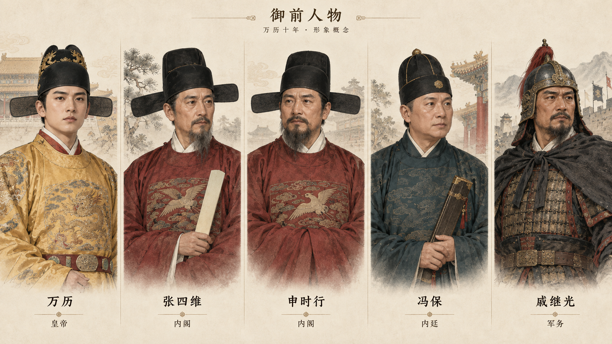

# 首批人物形象概念 v1

状态：待用户反馈；当前用于统一人物画风，未完成全部人物名册与独立立绘素材。

生成日期：2026-09-24。方式：内置 Image Gen。



## 人物与用途

首批采用万历、张四维、申时行、冯保、戚继光，覆盖皇帝、内阁、内廷与军事人物。立绘用于召见和议政，缩略头像用于消息出处与具名意见。具体开局人物名单仍需结合日期继续核实。

画风为克制的写实绘画；通过年龄、轮廓、服饰与身份形成区别，不用善恶脸谱、光效或数值标注暗示忠奸。画像是艺术化设计，不能声称精确复原历史容貌。具体冠服和仪制细节尚需在正式素材阶段核对。

## 本轮核实的历史依据

- [故宫博物院·万历皇帝](https://www.dpm.org.cn/court/lineage/226265.html)：记载朱翊钧生于 1563 年，因此 1582 年的开局形象应是青年；年表记载 1582 年张居正去世后张四维任首辅，1583 年申时行接任。两位阁臣在本稿均使用“内阁”身份标签。
- [故宫博物院·申时行](https://www.dpm.org.cn/lemmas/245028.html)：记载其生于 1534 年及张居正死后张四维、申时行先后掌权。
- [故宫博物院·谁是画中人](https://www.dpm.org.cn/Uploads/File/2020/03/30/u5e8197182299d.pdf)：讨论万历初年的司礼太监冯保。此稿不使用有争议的精确年龄作为形象验收依据；其任职起止仍需结合最终开局日期核对。
- 万历人物资料也记载戚继光在相关时期负责边镇练兵，本稿将其作为军事人物的画风样本，具体职衔不在图中展开。

史料支持的是时代背景与身份，不支持图中每个五官、服饰细节或虚构台词。没有附加历史画像作为生成参考，不将图像称为依据原像复原。

## 视觉检查

已查看生成结果：五人形象分明、画风一致、姓名可辨，没有人物评分或忠奸标签。当前是一张概念合稿，后续游戏所需的独立立绘、透明背景、头像与年龄变化素材尚未制作。

## 完整生成提示词

```text
Use case: stylized-concept / historical game character design.
Create ONE cohesive character concept sheet for a serious historical dynasty numerical simulation game, wide landscape approximately 2400 x 1350. FIVE distinct, equally carefully painted waist-up portraits in five elegant vertical columns on the same warm ivory paper background. This is one art-direction sheet, NOT a game screen and NOT five separate UI mockups. Each column has ample headroom, the full head/hat is visible, lower body gently fades into paper, and a simple Chinese name under the portrait. Show no stats, rarity badges, cards, moral adjectives or gameplay systems. Small heading “御前人物” and unobtrusive subtitle “万历十年 · 形象概念”. All figures are artistic interpretations, not asserted exact recovered likenesses.

Style: premium hand-painted historical strategy game character illustration, restrained semi-realism blended with fine Chinese gongbi brush contours and soft mineral watercolor shading, convincing individual faces, natural skin texture, sober grounded presence. Muted cinnabar, pine green, ink black, antique ochre; delicate fabric pattern detail and material distinction, consistent soft daylight. Compatible with an ivory/pine/cinnabar mobile game UI. Each face must remain identifiable at small avatar size. Mature thoughtful natural faces, not anime, not beauty-filter idols, not caricatures. None should visibly signal “villain” or “hero”; all are composed people with professional bearing. No magical glow, power aura, stylized horns, sinister lighting, evil smirk, scars invented to imply villainy, oversized weapons or fantasy armor. No Qing queues, Qing court beads or Qing cone hats; no European clothing.

Historical setting anchor: shortly after Zhang Juzheng's death in 1582. Zhang Juzheng is NOT present. The young Wanli emperor was born in 1563 and should look approximately 19, not like an elderly emperor. Zhang Siwei is the chief grand secretary at this selected point; Shen Shixing is an experienced grand secretary and is NOT yet labeled chief. Feng Bao is a palace eunuch from this opening-era court; exact detailed age/likeness is not asserted. Qi Jiguang is a mature frontier military figure. Do not depict them as characters from a television adaptation or imitate any actor.

Left to right:
1. Name “万历”. Young Chinese man around 19, fuller oval face, clear eyes, calm but newly assertive posture, little or no visible facial hair. Ming black winged-shan imperial cap with restrained rear wings, ochre-yellow imperial round-collar robe with subtle embroidered dragon motif, hands quietly resting near waist. His status is conveyed through appropriate attire, not exaggerated jewels. Small role label “皇帝”.
2. Name “张四维”. Chinese scholar-official in his mid-fifties, somewhat long face, high forehead, neat slim mustache and trimmed grey-black beard, contained attentive expression. Ming black wushamao with horizontal wings, dark muted crimson official robe, restrained bird rank-badge suggestion, an ivory memorial tablet held calmly. Small label “内阁”.
3. Name “申时行”. Chinese scholar-official in his late forties, broader oval face than Zhang, distinct brow and slightly fuller beard, composed thoughtful gaze. Ming black wushamao, muted wine-red official robe with a subtle bird-badge suggestion, hands in sleeves. Small label “内阁”.
4. Name “冯保”. Middle-aged Chinese palace eunuch, naturally clean-shaven, broad face, measured attentive expression, no villain coding, no exaggerated effeminacy. Understated Ming palace-service attire in deep blue-green with dark modest round official cap, a closed slim document case carried naturally. Small label “内廷”.
5. Name “戚继光”. Mature Chinese military commander in his early fifties, weathered but natural face, neat mustache and short beard, steady observant expression. Grounded late-Ming military clothing with subdued brigandine or lamellar detail under a plain dark outer garment and a restrained practical Ming helmet; no dramatic battle pose. Small label “军务”.

Emphasize distinct face structures, ages, headgear silhouettes and clothes, while keeping every person equally respectful and emotionally ambiguous. Clean elegant name typography, exact simplified Chinese labels only. No historical achievements, biographies or judgment text. This is a first visual alignment sheet for the emperor and initial important court/military figures.
```
