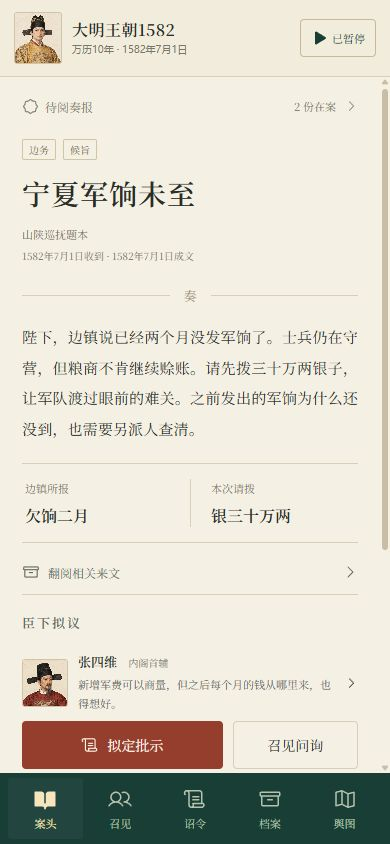
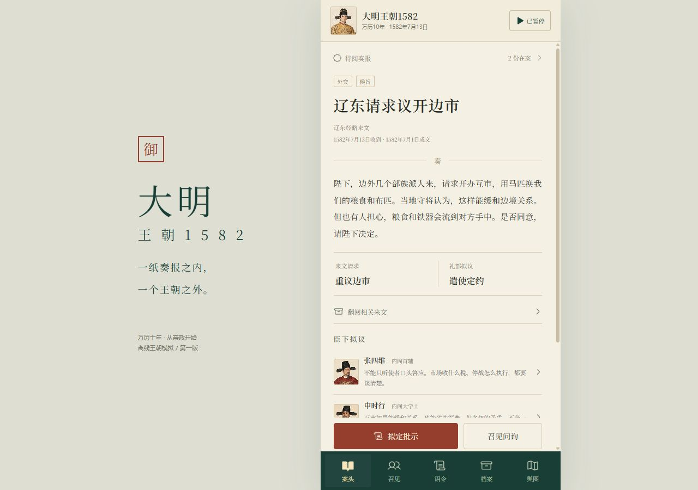

# 第一版视觉核对

基准：此前确定的 `mobile-screen-v1.png`、`characters-v1.png`，以及最新要求“手机竖屏”“现代语言”“大明王朝1582”。验收使用真实运行截图，没有把概念图当成实现截图。

## 已核对

- 暖纸色正文、墨绿导航、朱红批示主按钮；保留原方案的奏报阅读与人物代入感。
- 顶部为皇帝、日期和时间开关，底部五个固定导航；批示入口在阅读时保持可达。
- 正文使用现代中文完整说明情况、请求和争议；保留陛下、军饷、内阁、户部等词，不用忠奸色彩、真假角标或可信度条暗示答案。
- 万历与四位首批臣下使用独立画像。画像完整加载；后继人物明确为职官示意画像。
- 320 像素窄屏可阅读和操作，长文纵向滚动；390 像素手机布局通过。1280 像素桌面保留约 440 像素游戏列，旁置题字，不拉长阅读行。
- Android 正式包验证状态栏区域、底部导航和弹层；未用网页内的虚构手机边框替代真实设备适配。

## 有意调整与局限

现代中文比概念图更长，正文、臣下建议和次要来文需要滚动；优先保证阅读与触控尺寸。首版没有动画演出或完整地图美术，舆图以区域来文为核心，避免变成全知状态面板。概念图只是视觉参考，最终内容以已确认玩法和实际功能为准。

引擎、存档与 Android 验证记录见 [QA.md](../QA.md)。
