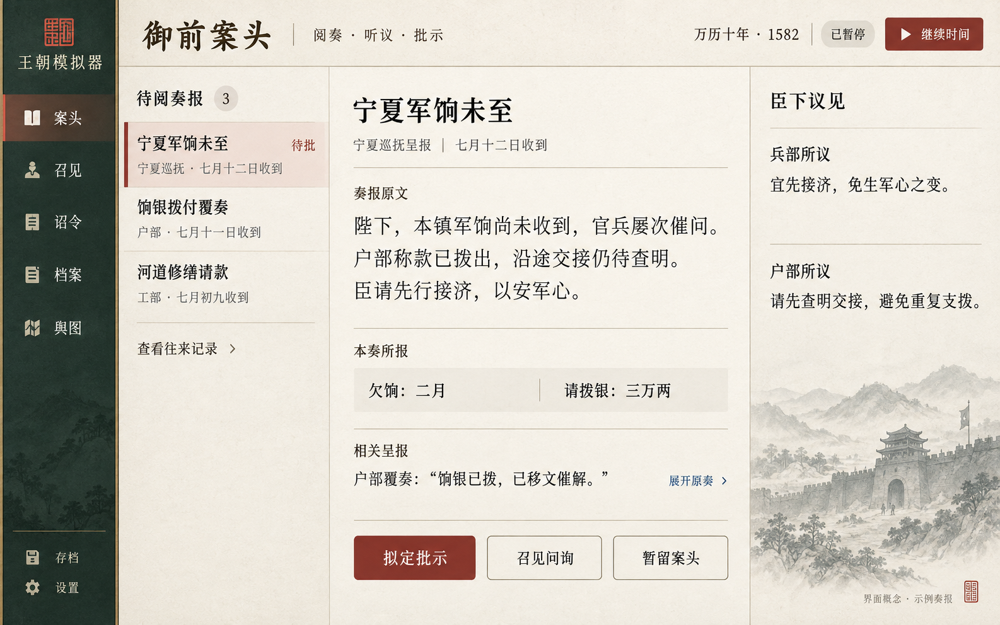

# 主界面效果图 v1：御前案头

状态：桌面横屏探索稿，已被用户要求的手机竖屏方向替代。当前请查看 [手机竖屏主界面 v1](mobile-screen-v1.md)。本稿仅保留为过程参考，不作为实现目标。

生成日期：2026-09-24。方式：内置 Image Gen，单张 UI 概念图。



## 本次对齐内容

- 本地网页桌面视口，以奏报阅读和关键批示为主要操作。
- 深绿导航、浅纸色正文、朱红操作强调，少量水墨插画。
- 左侧待阅奏报，中间原文及关联呈报，右侧臣下不同意见。
- 数据注明为本奏所报，不显示后台真实资源、真假或人物评分。
- 图片中的日期、奏报、官员角色、金额与插画均用于概念演示，不作为历史事实、正式开局日期、数值配置或已确认剧情。
- 仅用于视觉与布局讨论，当前没有可交互页面。待用户反馈后确定实现目标。

## 视觉检查

已查看生成结果：单屏布局完整，奏报、出处、批示区清楚，未出现真实国力、腐败度或可信度面板。后续实现使用实际字体和可选择文字重建 UI，图中文字不能直接充当功能界面。

## 完整生成提示词

```text
Use case: ui-mockup.
Create ONE polished, believable desktop game UI screenshot, 1600 x 1000 landscape, full-bleed application content, no browser chrome, no device, no perspective. This is a first visual alignment concept for a LOCAL WEB historical numerical simulation game provisionally named “王朝模拟器”. The real current date is 2026-09-24 but the GAME screen is explicitly set in 1582, “万历十年”; use the historical game date, never a contemporary date. All pictured events and amounts are fictional demonstration content.

Product premise: the player is the Ming emperor, receiving fallible reports and ministers’ proposals and making major decisions. The world runs in a deep simulation but the emperor NEVER sees ground-truth stats, corruption, loyalty, trust percentages, intelligence truth labels, hidden scores, success probabilities, omniscient population totals or modern global-resource counters. Nothing should label a report as true, false, suspicious, verified, best, recommended or high-confidence. Only source, received-date, document status, quoted claims and requested amounts may be shown. This is a sober long-session strategy simulation, not a fantasy RPG or management SaaS dashboard.

Art direction: quiet, beautiful imperial archive/editorial interface. Warm ivory paper main surface, charcoal ink text, deep muted pine-green narrow navigation, restrained dark cinnabar action accent, very thin antique-brass rules. A subtle paper grain that never obscures text. Tiny tasteful seal symbol. Song/Ming-style Chinese serif for a few headings; clean legible Chinese sans-serif for body and controls. Generous spacing but useful information density. Small, low-contrast ink-wash illustration of a frontier gate and distant hills occupies only a modest supporting area at lower right (about 10% of screen). No giant throne scene, realistic wooden tabletop, hanging scroll borders, baroque gold ornament, dragons, portraits with stat bars, 3D palace or decorative clutter. Production-ready frontend aesthetic with precise alignment, flat lists, thin separators, no repeated card grids, no card-in-card frames.

Layout:
1. Slim full-height left navigation approximately 150 px. Top small seal + “王朝模拟器”. Vertically spaced navigation: “案头” selected, “召见”, “诏令”, “档案”, “舆图”. Bottom unobtrusive “存档” and “设置”. No hidden score icons.
2. Main top header with a refined heading “御前案头” and subtitle “阅奏 · 听议 · 批示”. Top right “万历十年 · 1582”, small neutral status “已暂停”, clear “继续时间” play control. The active frame is paused to read.
3. Below the header, a narrow incoming memorial list around 265 px with label “待阅奏报” and neutral count “3”. Three restrained rows, not cards:
“宁夏军饷未至” / “宁夏巡抚 · 七月十二日收到” / “待批”
“饷银拨付覆奏” / “户部 · 七月十一日收到”
“河道修缮请款” / “工部 · 七月初九收到”.
First row is selected using a soft tinted background and slim cinnabar selection rule, without any credibility implication.
At list bottom simple “查看往来记录”.
4. The broad central reading surface, approximately 600 px wide, is the hero. Document title “宁夏军饷未至”, a small provenance line “宁夏巡抚呈报｜七月十二日收到”. Label “奏报原文”. Large comfortable Chinese body with natural line wrapping:
“陛下，本镇军饷尚未收到，官兵屡次催问。
户部称款已拨出，沿途交接仍待查明。
臣请先行接济，以安军心。”
Below text a quiet horizontal factual strip labeled “本奏所报”, two quoted-report fields: “欠饷：二月” and “请拨银：三万两”. These are reported claims, not validated figures.
After a fine divider, “相关呈报” and an attributed quotation: “户部覆奏：饷银已拨，已移文催解。” A subtle inline link “展开原奏”.
At bottom central action area, one primary cinnabar button “拟定批示”, two quieter supporting controls “召见问询” and “暂留案头”. No technical investigation parameters, no transport route planning, no precise accounting form.
5. A restrained supporting right column about 300 px, heading “臣下议见”. Two typographic blocks separated only by a line:
“兵部所议”
“宜先接济，免生军心之变。”
“户部所议”
“请先查明交接，避免重复支拨。”
Each viewpoint must visibly belong to its ministry; the system does not adjudicate their truth. Below, the small atmospheric ink-wash illustration. Small unobtrusive footer “界面概念 · 示例奏报”.

Render every specified Chinese label accurately and legibly. Keep interface text horizontal and comfortable to read. Text should be substantial enough to show this is a numerical/governance simulator, while avoiding cramped tables or tiny illegible prose. No extra invented metrics, notifications, badges, tooltips or menu features. Preserve clean layout and emperor-limited information. Output a single high-quality screen only.
```
