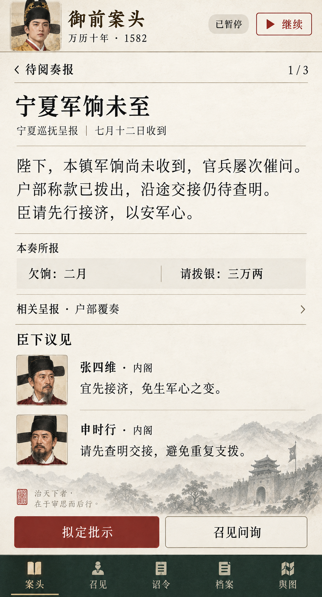

# 手机竖屏主界面 v1：御前案头

状态：当前视觉讨论稿，待用户反馈；尚未确定为正式 UI。

生成日期：2026-09-24。方式：内置 Image Gen。参考了桌面探索稿与本次人物概念稿。



## 本次落实的要求

- 手机竖屏优先，第一版同时交付网页和 Android APK；不再以桌面横屏为主要设计目标。
- 单次阅读一件政务；原文、所报数字、相关呈报与臣下意见形成一条纵向阅读路径。
- 万历头像表现玩家身份，阁臣头像与具名议见帮助建立人物印象。
- 底部提供主要批示操作与导航，避免要求玩家填写执行细节。
- 仍不展示真假、腐败度、忠诚度或全知资源面板。

当前图片是不可交互的概念图。画像、台词、日期、金额、装饰文字均不直接作为正式剧情、开局配置或史实依据。后续实现需重新排版真实文字，并核验小屏、滚动、按钮触控与安全边距，不能用整张图片代替功能界面。

## 视觉检查

已查看生成结果：竖向阅读路径和底部操作完整，万历与两位阁臣的头像已融入界面，数字注明为“本奏所报”。实际手机尺寸和交互尚未验证。

## 完整生成提示词

```text
Use case: ui-mockup.
EDIT/REDESIGN the attached desktop concept into ONE entirely recomposed MOBILE PORTRAIT game screen for the same historical emperor numerical simulation. Reference image 1 is the earlier desktop UI: use its visual style and content, NOT its layout. Reference image 2 is the newly generated five-character concept sheet: use it as the exact character identity/style reference. Output app content only, edge to edge, at the natural proportions of a 390 x 844 logical-pixel phone viewport, rendered at high resolution (approximately 9:19.5 portrait). No device bezel, no phone photograph, no OS status bar, no browser chrome, no notch or system home indicator. One screen only, not a montage. Current real date is 2026-09-24; visible dates are deliberately the historical GAME date “万历十年 · 1582”.

Product constraints from the agreed brief: first version will ship both as a local WEB game and Android APK, with one mobile-first interface. The emperor reads potentially inaccurate memorials and advisers' recommendations, then makes major decisions; officials handle implementation. Player never sees actual resource totals, corruption, loyalty, confidence scores, lie indicators, hidden stats, success probabilities, optimal decisions or system recommendations. All figures are attributed to reports. Gameplay is slowly paced and supports a long saved campaign. This frame is PAUSED to read one memorial. Events, sums and dates shown are fictional mock content, not a historical factual claim.

Keep the attached image's restrained imperial archive visual language: warm ivory paper, dark ink, deep muted pine green, a restrained dark cinnabar main action, thin antique-brass dividers. Beautiful, sophisticated and very readable. Very light grain. Headings in elegant readable Chinese Song serif; controls/body in crisp legible Chinese type. Very small seal mark and a faint ink-wash mountain/gate accent only if there is spare space. Illustration must never compete with the memorial. NOT a fantasy RPG, mobile monetization game or SaaS dashboard. NO currencies at top, no health/energy, no timers counting toward victory, no daily rewards, no floating menus, no unnecessary cards or shadows. Flat grouped surfaces, careful spacing, natural scrolling design; avoid nested cards.

Recompose around ONE active memorial, not the desktop's simultaneous four columns:
- Compact header, about 56 logical px. Left a 44 logical-px portrait thumbnail of the young Wanli emperor from the LEFTMOST character in reference image 2, then text “御前案头”. Beneath in small legible text: “万历十年 · 1582”. The emperor thumbnail is meaningful player identity, not a giant hero banner. Right compact neutral “已暂停” and a small outline play control “继续”. Top should feel like a mobile game tool bar, not a website masthead.
- Main content uses about 20 logical px horizontal margins. Above the memorial a slim navigation row “‹ 待阅奏报” with “1 / 3” at right. Inbox list is off screen, accessible by back control. No hamburger needed.
- Main title “宁夏军饷未至” at about 24 logical px.
- Provenance at 12–13 logical px: “宁夏巡抚呈报 · 七月十二日收到”.
- Thin divider then body text about 16 logical px, comfortable 1.65 line height, exact Chinese text:
“陛下，本镇军饷尚未收到，官兵屡次催问。
户部称款已拨出，沿途交接仍待查明。
臣请先行接济，以安军心。”
Make it effortless to read on a phone; wrap naturally, no microscopic text.
- A quiet, short pale-tinted report strip titled “本奏所报”, with two clearly attributed fields side by side: “欠饷 二月” and “请拨银 三万两”. These are quoted report claims, never verified numbers.
- One compact expandable row: “相关呈报 · 户部覆奏” and a chevron.
- Section heading “臣下议见”. Two compact typographic rows, no boxed cards:
First row: 36–40 logical-px portrait of Zhang Siwei (SECOND character in reference image 2), name line “张四维 · 内阁”, next line “宜先接济，免生军心之变。”
Second row: 36–40 logical-px portrait of Shen Shixing (THIRD character in reference image 2), name line “申时行 · 内阁”, next line “请先查明交接，避免重复支拨。”
Each label attributes the suggestion; no red/green truth colors, recommendation tags, or rankings.
- At the bottom, a stable comfortable thumb-level action rail above navigation, with one broad cinnabar button “拟定批示”, plus a quiet secondary button “召见问询”. Minimum about 44 logical px touch height, visible safe spacing. These are preparation/opening actions, NOT automatically executing any suggestion.
- A compact full-width pine-green bottom tab bar with five evenly spaced simple icon+label items: “案头”, “召见”, “诏令”, “档案”, “舆图”. “案头” selected in pale ivory/gold, others muted but readable. No pixel-perfect desktop nav crammed into the side. Respect safe content margins.

Do not force all desktop copy or art into this screen. Prioritize mobile reading hierarchy and comfortable buttons. Use the requested exact simplified Chinese text and do not invent extra labels. The top date, named source and claim labels must remain visible. No offscreen feature inventory, no debug annotations. The result should look like a realistic, refined shippable portrait mobile game UI screenshot that could be built identically for web and APK.
The user explicitly asks for emperor and important minister portraits to increase immersion. Include those three small character portraits in this screen using reference image 2 faithfully. Keep the other two characters off this screen; they belong to other encounters. The attributed dialogue here is fictional mockup text, not historical quotations. Keep portraits legible and maintain body text size; do not cram all five figures into the UI.
```
